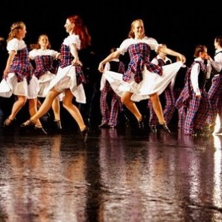
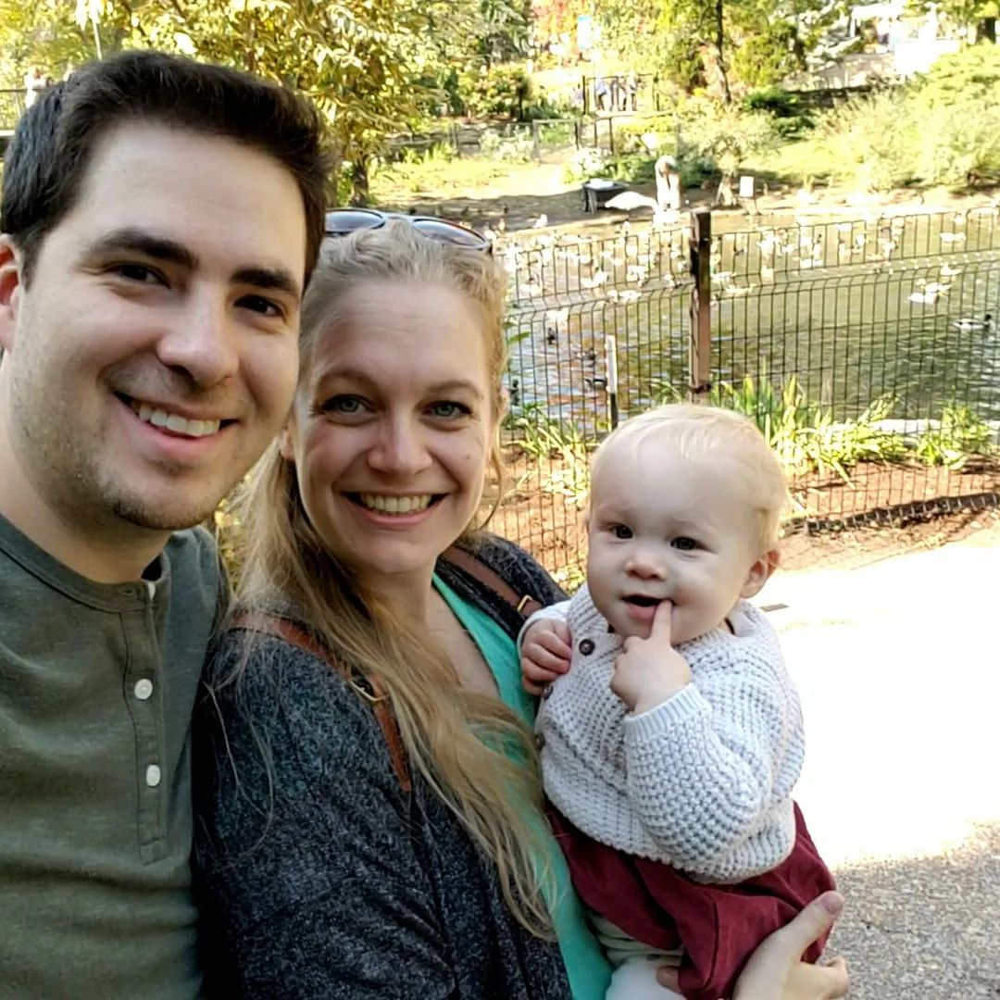
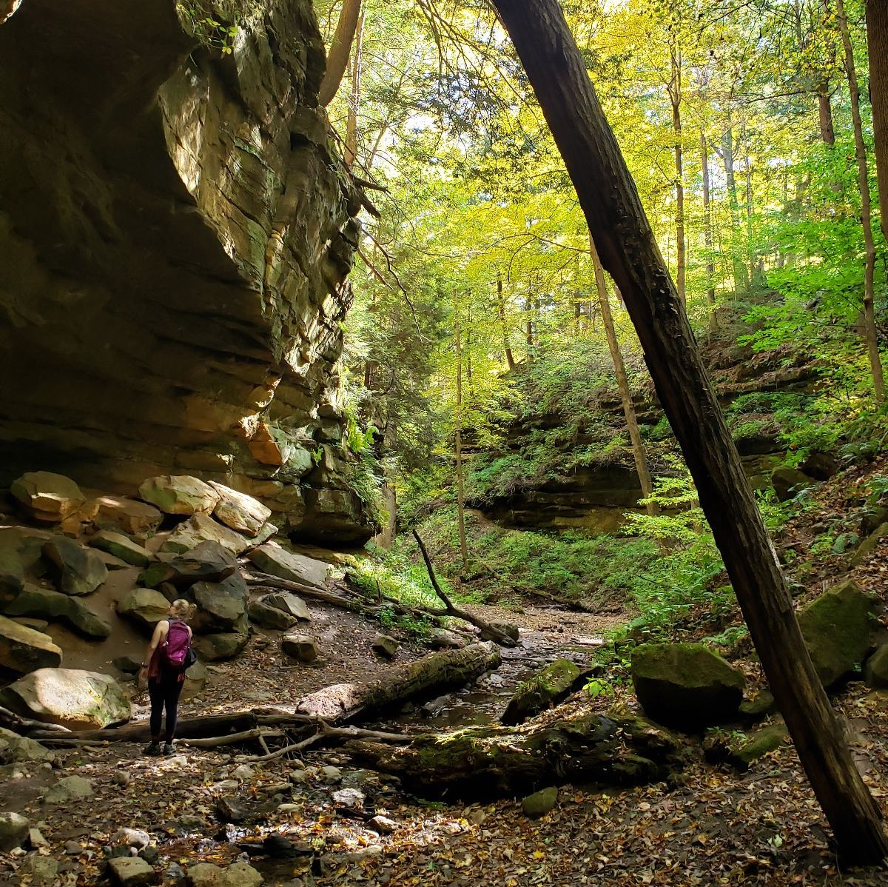
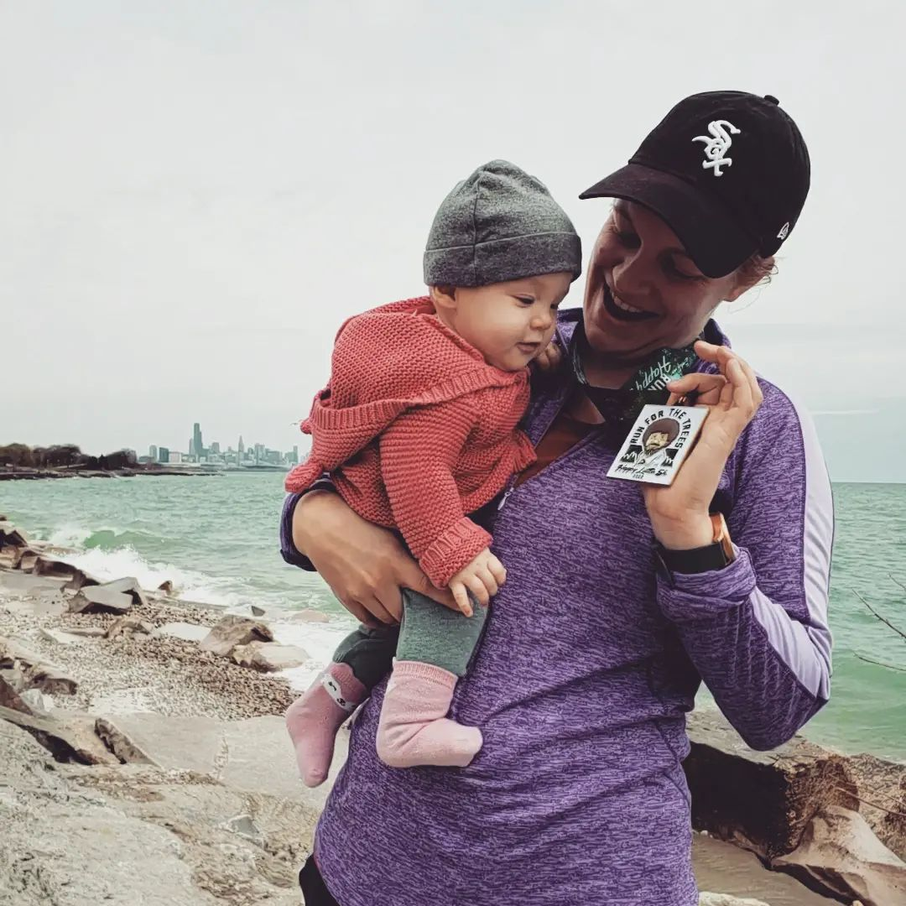

I grew up in Niagara Falls, Ontario, Canada, where I did competitive Scottish Highland Dancing - including competing at the [World Championships](https://cowalgathering.com/) in Dunoon, Scotland and performing as part of the [Royal Edinburgh Military Tattoo](https://www.edintattoo.co.uk/) in Edinburgh, Scotland. I continued to compete and perform throughout grad school and am still a certified highland dance teacher!

Before joining Rutgers, I did a postdoc at the University of Chicago primarily with [Dr. Susan Levine](https://cogdevlab.uchicago.edu/), my PhD at Boston College with [Dr. Sara Cordes](https://sites.bc.edu/sara-cordes/infant-and-child-cognition-lab-at-boston-college/) and my undergraduate in Mathematics at [McMaster University](https://www.math.mcmaster.ca/). When beginning my math degree, I had no idea I would end up a psychology PhD and my route to get here was atypical and full of serendipitous moments. But, now I get to study how people think about mathematical ideas and the surprising mathematical intuitions held by young kids, while continuing to do math myself through advanced computational and statistical methods. 

I live in New Jersey with my partner and our daughter. I love being outside hiking and camping, especially in the fall. When the weather is less great, I also like to bake and paint watercolors. Although I don't really dance anymore (but maybe I will again!), I'm an active runner and enjoy finding new and interesting running routes!


<div class = "row">
  
<div class = "col-md-3">
```{r out.width = "100%",  out.extra='style="align:center"',echo=FALSE}

```

</div>
<div class = "col-md-3">
```{r out.width = "100%",  out.extra='style="align:center"', echo=FALSE}

```

</div>
<div class = "col-md-3">
```{r out.width = "100%",  out.extra='style="align:center"', echo=FALSE}

```

</div>
<div class = "col-md-3">
```{r out.width = "100%",  out.extra='style="align:center"',echo=FALSE}

```
</div>

</div>
<br>

  


