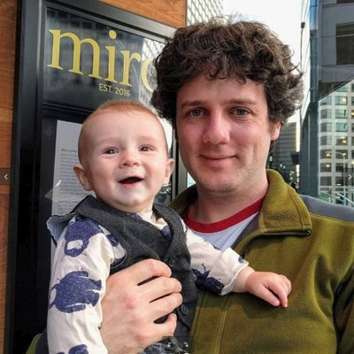
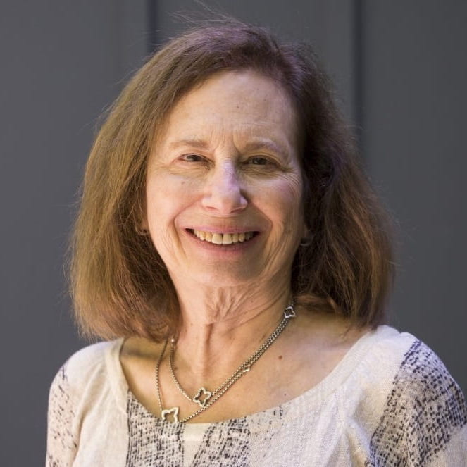
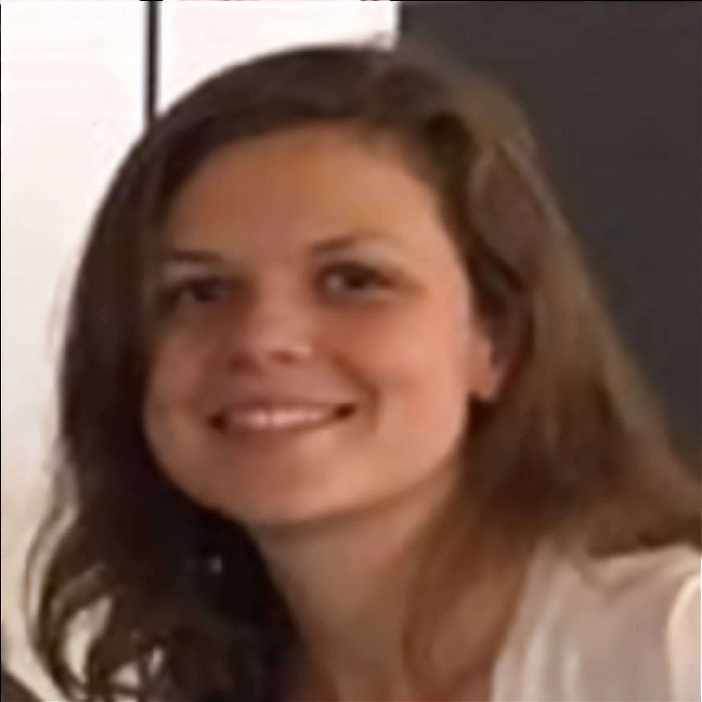
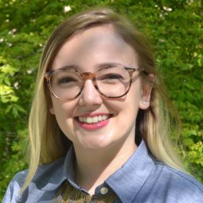
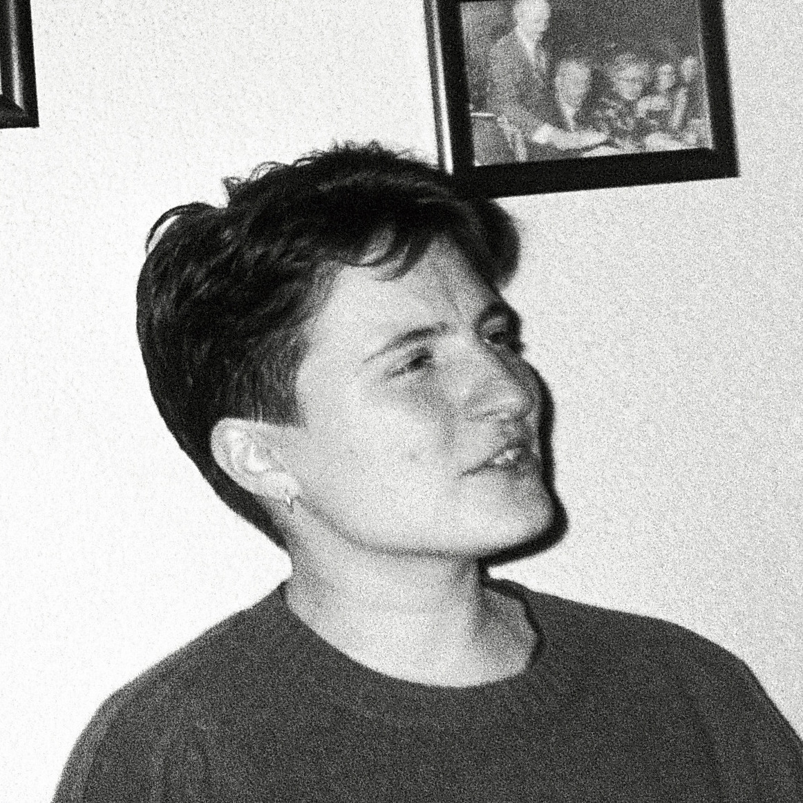
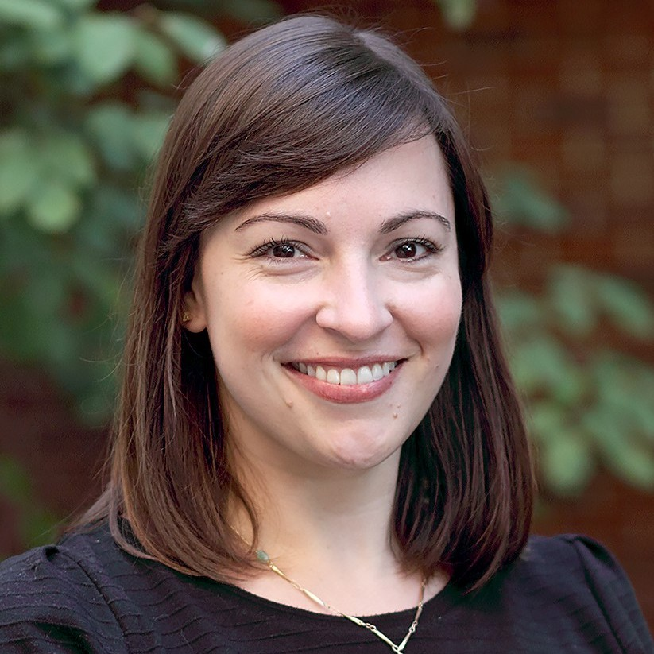
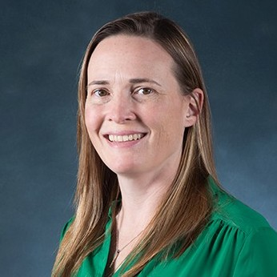

I collaborate with some great folks on different projects. See more about them and their research below. 

<div class = "row">
  
<div class = "col-md-4">
```{r out.width = "100%",  out.extra='style="align:center"',echo=FALSE}

```
<center>
[Steve Piantadosi](http://colala.berkeley.edu/people/piantadosi/)
<br>University of California, Berkeley
</center>
</div>

<div class = "col-md-4">
```{r out.width = "100%",  out.extra='style="align:center"', echo=FALSE}

```
<center>
[Susan Levine](https://psychology.uchicago.edu/directory/susan-c-levine)
<br>University of Chicago
</center>
</div>


<div class = "col-md-4">
```{r out.width = "100%",  out.extra='style="align:center"', echo=FALSE}

```
<center>
[Nadia Chernyak](https://www.dosclab.com/personnel)
<br>University of California Irvine
</center>

</div>
</div>

<br>
<br>

<div class = "row">

<div class = "col-md-4">
```{r out.width = "100%",  out.extra='style="align:center"',echo=FALSE}

```
<center>
[Jake Butts](https://psychology.uchicago.edu/directory/jacob-butts)
<br>University of Chicago
</center>
</div>
  
<div class = "col-md-4">
```{r out.width = "100%",  out.extra='style="align:center"', echo=FALSE}

```
<center>
[Maddy Oswald](https://www.madeleineoswald.com/)
<br>University of Chicago
</center>
</div>


<div class = "col-md-4">
```{r out.width = "100%",  out.extra='style="align:center"', echo=FALSE}

```
<center>
[Claire Bergey](https://clairebergey.net)
<br>University of Chicago
</center>

</div>
</div>

<br>
<br>

<div class = "row">

<div class = "col-md-4">
```{r out.width = "100%",  out.extra='style="align:center"', echo=FALSE}

```
<center>
[Steve Ferrigno]( https://www.sferrigno.com/)
<br>Harvard University
<br>(soon to be University of Wisconsin Madison)
</center>
</div>


<div class = "col-md-4">
```{r out.width = "100%",  out.extra='style="align:center"', echo=FALSE}

```
<center>
[Sarah Eason](https://www.purdue.edu/hhs/hdfs/directory/faculty/eason_sarah.html)
<br>Purdue University
</center>
</div>

<div class = "col-md-4">
```{r out.width = "100%",  out.extra='style="align:center"', echo=FALSE}

```
<center>
[Sara Cordes](https://sites.bc.edu/sara-cordes/infant-and-child-cognition-lab-at-boston-college/)
<br>Boston College
</center>
</div>

</div>


<br>
<br>

