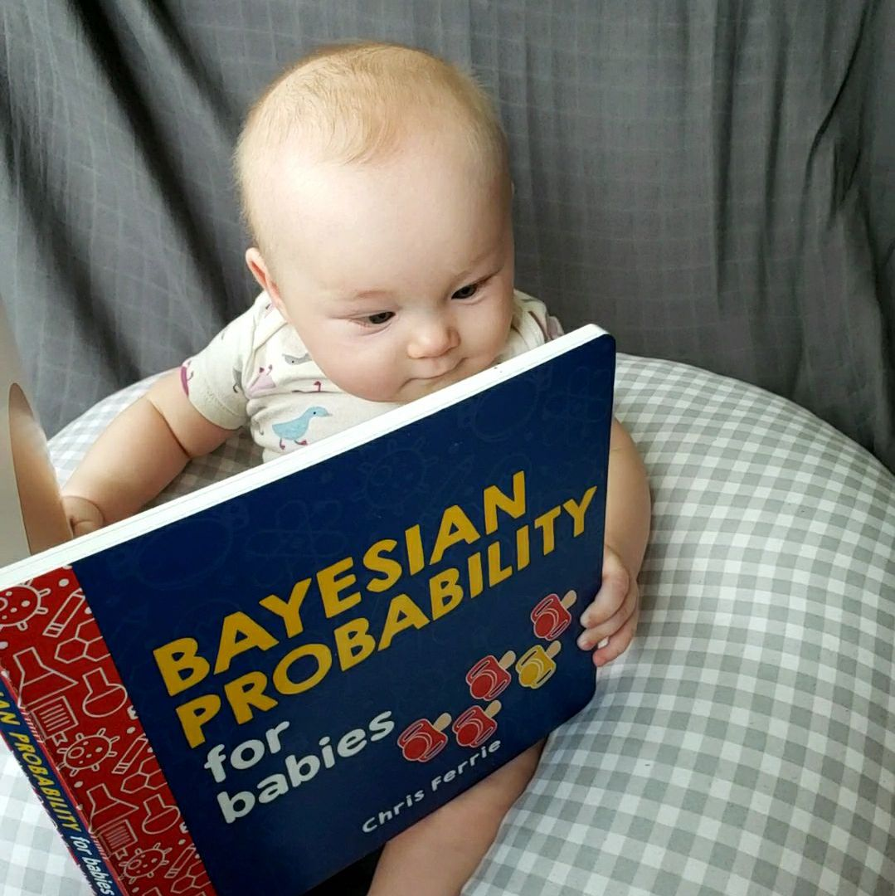
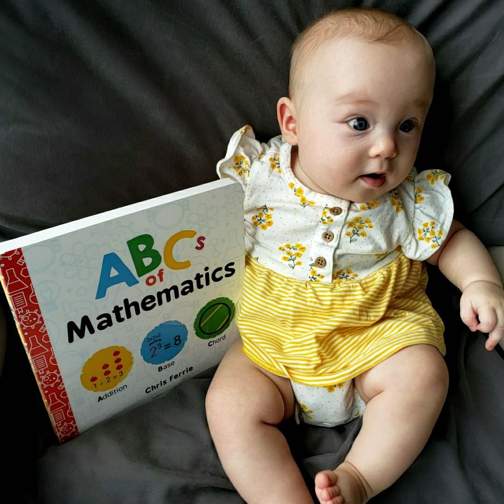

```{r setup, include=FALSE}
knitr::opts_chunk$set(echo = FALSE)
```


My research program is focused on understanding how people make sense of the information around them - with a special focus on quantitative information. How do children reason about "how much" and "how many"? How do people combine amounts to think about proportions? How does the development of these skills support our ability to learn formal mathematics? 
<br>
<br>
Click on the projects below to learn more about projects addressing some of these important questions.
<br>
<br>

<div class = "row">

<div class = "col-md-4">
[](projects_strategies.html)
<center>
<strong>[Strategies for Proportion Judgements](projects_strategies.html)</strong>
</center>

</div>
<div class = "col-md-4">

[](projects_processes.html)
<center>
<strong>[Process Models of Proportional Reasoning](projects_processes.html)</strong>
</center>
</div>

<div class = "col-md-4">
[](projects_language.html)
<center>
<strong>[Mathematical Language and Symbols](projects_language.html)</strong>
</center>

</div>
</div>

