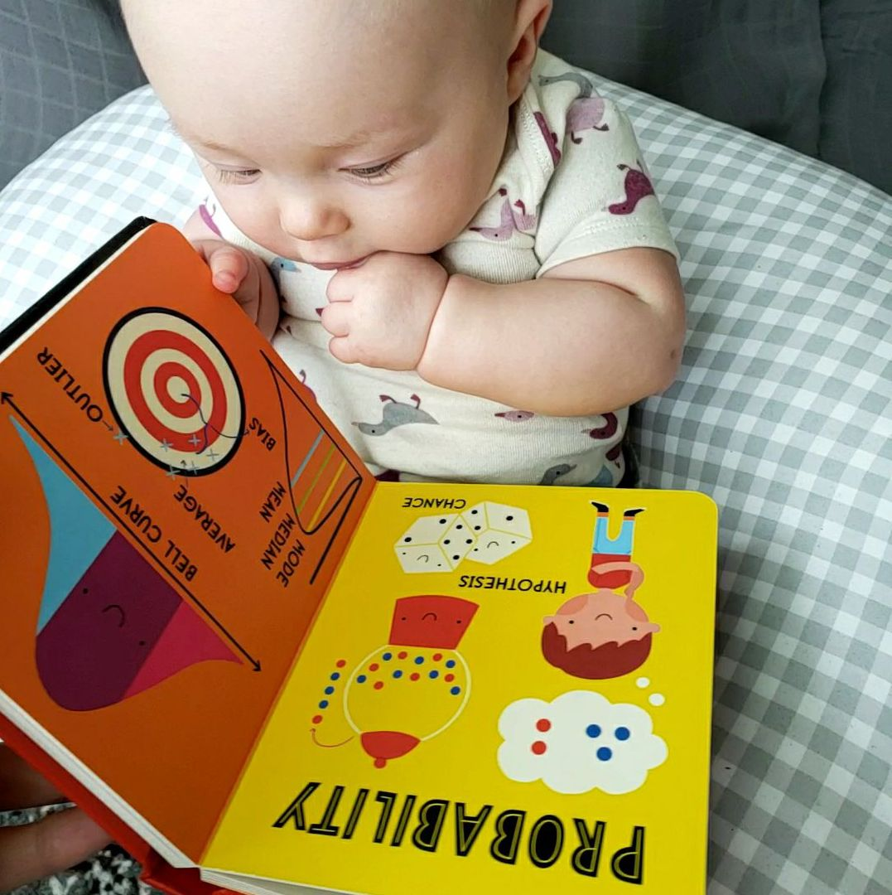

```{r setup, include=FALSE}
knitr::opts_chunk$set(echo = FALSE)
```


<div class = "row">
<div class = "col-md-10">


::: {.floatting}

Although most my current research program is focused on how people think about non-symbolic quantitative information - like sets of dots or rectangles representing "stuff" - I am also interested in the symbols we use to formally represent and communicate about this information. 

# Mathematical Notation

Even young children learn mathematical notation through number words (one, two, three...) and numerals representing integers (1, 2, 3... ). And, math notation continues to increase in complexity with decimals and fractions and then into algebra. In this line of work, I'm particularly interested in how children and adults think about different symbolic representations. For example, how do children learn to connect their verbal number word "two" to the written numeral "2"? This mapping problem between different symbolic representations becomes even more complex for rational numbers, which can be represented using multiple symbol systems (e.g., 1/2 = 0.5) and are often labeled with many different possible labels (e.g., one half, one out of two, point five). Given this complexity, and the difficulty that children have learning symbolic fractions, it's important to ask what are the benefits and pitfalls of different notations, such as fraction notation compared to the equivalent value in decimal notation? How can the strengths and limitations be accomodated in math instruction to support learning?

# Relational Language

Another line of work looks at children's interpretation of relational language - words that describe relations, and specifically quantitative relations, such as before, bigger, more, and most. In this line of work, I've studied children's understanding of specific words - such as how they interpret the word most over development and across contexts - and how children map different words to the same or similar quantitative dimensions. For example, in one line of studies, I've compared how children map "after", "bigger", and "more" to numbers further along in the count list (e.g., 6 comes after 5, is bigger than 5, and is more than 5). Children show systematically different patterns of responding for ordinal language (before and after) and magnitude language (bigger and smaller), suggesting that these two dimensions may not be entirely overlapping for young children. 


:::

</div>
</div>

# Other Projects...

<div class = "row">

<div class = "col-md-4">
[](projects_strategies.html)
<center>
<strong>[Strategies for Proportion Judgements](projects_strategies.html)</strong>
</center>

</div>
<div class = "col-md-4">

[](projects_processes.html)
<center>
<strong>[Process Models of Proportional Reasoning](projects_processes.html)</strong>
</center>
</div>


</div>
</div>