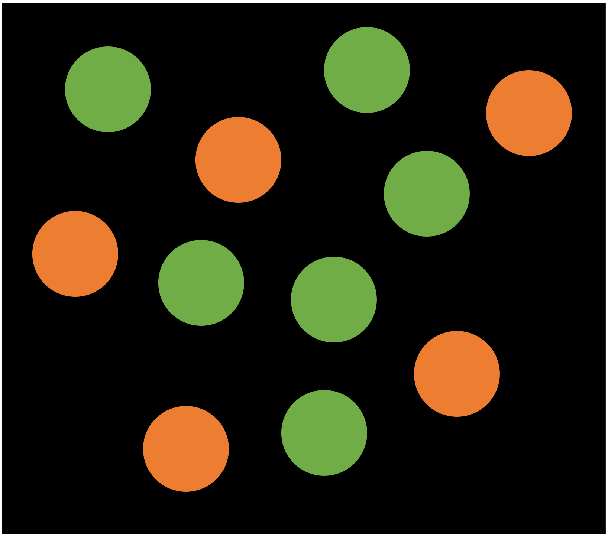

```{r setup, include=FALSE}
knitr::opts_chunk$set(echo = FALSE)
```


<div class = "row">
<div class = "col-md-10">


::: {.floatting}

People track proportional information in their environment and use this information to make inferences about the world. Building on this fundamental skill, many theories of cognitive development rely on this ability as a basic mechanism for learning. However, there is little agreement on *how* proportion is mentally represented and the processes that underlie it. In this line of work, I investigate how proportion is represented across development using experimental and computational methods. 

```{r out.width='40%', out.extra='style="float:right; margin:10px; border:1px solid black"', echo=FALSE}

```

For example, when we visually encode quantities with the intention of thinking about the proportion (say, the proportion of dots that are green) - do we encode the number of green and the number of orange separately and combine them? Or do we encode a gist representation of the relation, without encoding the separate amounts? Or do we do something else entirely? I use experimental paradigms to measure children's, adults', and infants' ability to compare and estimate proportional quantities of different kinds and compare the behavioral data to what we would expect based on each of the strategies (and others!) described above so that we can better understand the processes involved in proportional reasoning. 


:::

</div>
</div>

<br>
<br>

# Other Projects...

<div class = "row">

<div class = "col-md-4">
[](projects_strategies.html)
<center>
<strong>[Strategies for Proportion Judgements](projects_strategies.html)</strong>
</center>

</div>

<div class = "col-md-4">
[](projects_language.html)
<center>
<strong>[Mathematical Language and Symbols](projects_language.html)</strong>
</center>

</div>
</div>