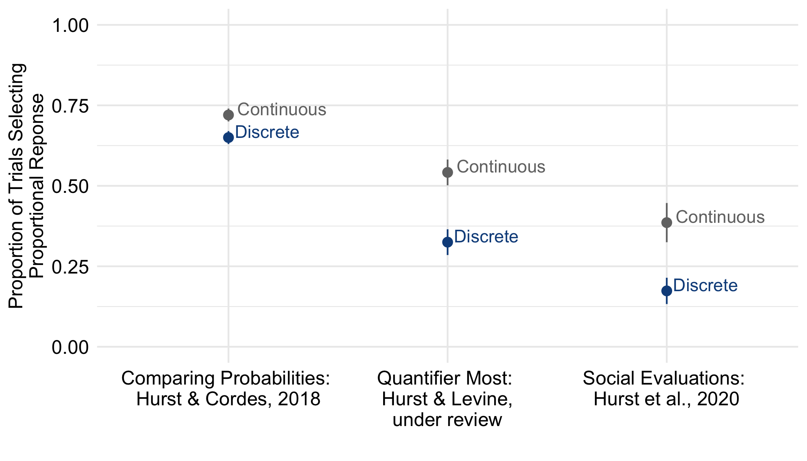
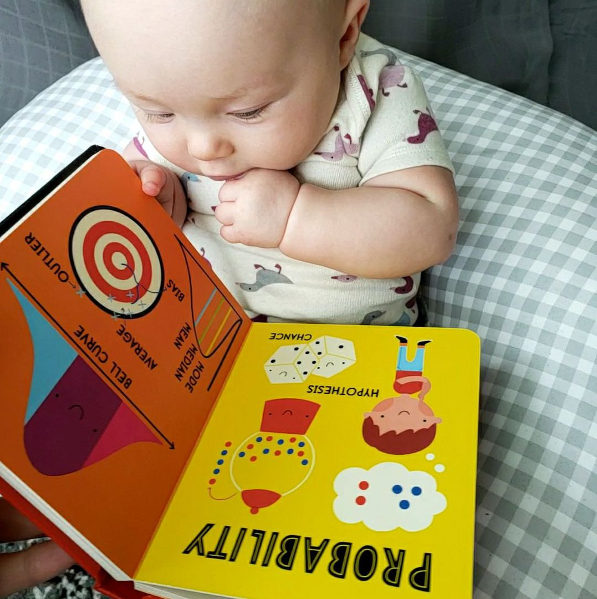
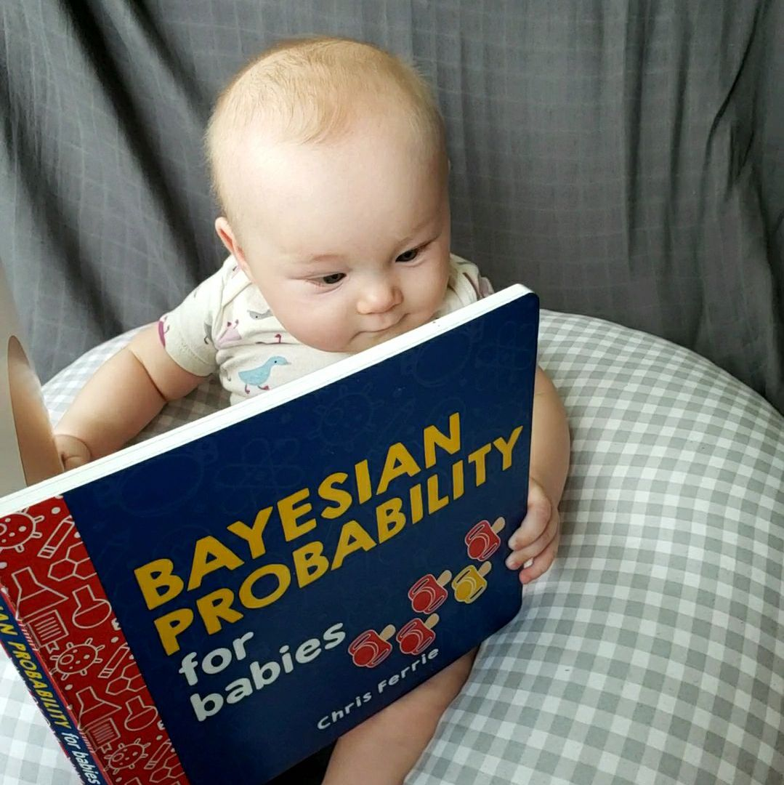
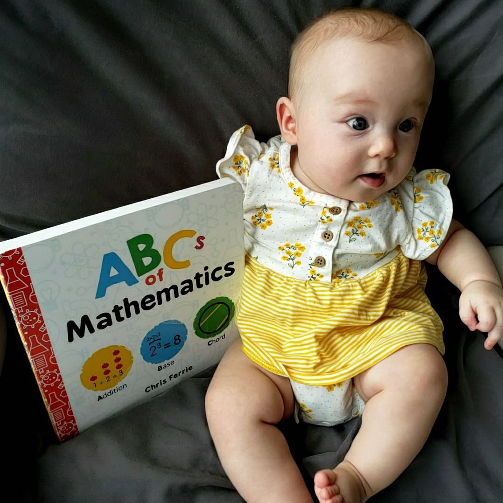

```{r setup, include=FALSE}
knitr::opts_chunk$set(echo = FALSE)
```


<div class = "row">
<div class = "col-md-10">


::: {.floatting}

Proportional information involves combining absolute quantities to form a relation. But, being able to flexibly reason about both absolute amounts and proportional relations is important, as each kind of quantity can provide different information. For example, imagine you are buying a bag of apples to make a pie. You inspect a bag at the store and see 8 good apples, exactly the number you need. This absolute information about the number of apples is sufficient to meet your current goal. However, whether those 8 good apples are in a small bag, making up 80% of the apples, or a large bag, making up 25% of the apples, provides additional information. You might use this ratio of good vs. rotten apples to make inferences about the quality of the bag or the expected good vs. rotten apple distribution in other bags of various sizes. As this example illustrates, we are often presented with information about absolute features (i.e., 8 apples) and the relations among them (i.e., 80% vs. 25%).

```{r out.width='40%', out.extra='style="float:left; margin:10px; border:1px solid black"', echo=FALSE}

```

In a series of studies, I found that children's attention to these different aspects of quantities - the absolute vs. proportional information -  differ based on the type of underlying quantity - specifically, whether it is a proportion of numerical quantities (like a set of dots or divided shapes) or a proportion of area (like an undivided shape, with some blue and some red). When the proportions are based upon continuous area, children are better at attending to proportional relations, whereas when the proportions are based upon numerical quantities, children are more likely to over-attend to absolute quantities. This leads to numerator based errors with discrete information, such as thinking the option with the larger numerator has the larger proportion, even when it doesn't (e.g., 2 out of 3 vs. 4 out of 9). Further, I have found this same pattern across different contexts - for probabilistic inferences, in children's proportional interpretation of the word "most", and when making social judgments based on how much characters shared. 

In ongoing work, I'm using a Bayesian strategy discovery approach to formally compare people's use of a numerator only comparison strategy versus a holistic proportion comparison strategies when comparing two proportional quantities. Preliminary analyses align with the empirical data described above: estimated model weights are higher for numerator comparison strategies than holistic proportion strategies when the stimuli are discrete, but the opposite is true when the stimuli are continuous. 


:::

</div>
</div>

# Other Projects...

<div class = "row">

<div class = "col-md-4">
[](projects_strategies.html)
<center>
<strong>Strategies for Proportion Judgements</strong>
</center>

</div>
<div class = "col-md-4">

[](projects_processes.html)
<center>
<strong>Process Models of Proportional Reasoning</strong>
</center>
</div>

<div class = "col-md-4">
[](projects_language.html)
<center>
<strong>Mathematical Language and Symbols</strong>
</center>

</div>
</div>